# Ensuring Quality Releases - Project Overview

Using Microsoft Azure, create disposable test environments and run a variety of automated tests with the click of a button. Additionally, monitor and provide insight into your application's behavior, and determine root causes by querying the application’s custom log files.
Add automated testing tasks during deployment of an application to a CI/CD pipeline in Azure DevOps to improve feature quality by decreasing % of failed tests.
## Environment Creation & Deployment
Utilize Terraform to apply Infrastructure as Code (IaC) concepts to create different environment tiers that enable effective testing of code as it reaches the different phases of the release management process.

## Automated Testing
Runs a load test suite post-deployment using JMeter to evaluate both a web application and web service’s performance (how well application performs under stress) in order to provide resource requirements, benchmarking metrics, and meet SLA (service level agreement) objectives.

Runs functional test suites post-application-deployment using Selenium to evaluate the quality of a web application in order to identify, reduce, and prevent defects before a production release.

Runs API-integration tests post-application-deployment using Postman to evaluate the quality of a web service in order to reduce defects before a production release.

## Monitoring & Observability
Azure Monitor to identify and mitigate operational issues by using thoughtfully constructed alerts from a mixture of virtual machines and application services.
Configure Azure Log Analytics to consume and aggregate custom application events in order to determine and address root causes of operational issues.

## Project Tools and Environment

- Azure DevOps
- Outlook account
- Azure Account
- DevOps account
- Azure CLI

## Dependencies

- Terraform
- JMeter
- Postman
- Python
- Selenium

## Installation & Configuration

### Terraform in Azure

1. Configure the storage account and state backend. https://docs.microsoft.com/en-us/azure/developer/terraform/store-state-in-azure-storage Replace the values below in terraform/environments/test/main.tf with the output from the Azure CLI:

    ```
    storage_account_name
    container_name
    access_key
    ```

2. Create a Service Principal for Terraform Replace the below values in terraform/environments/test/terraform.tfvars with the output from the Azure CLI:
https://registry.terraform.io/providers/hashicorp/azurerm/latest/docs/guides/service_principal_client_secret

    ```
    subscription_id
    client_id
    client_secret
    tenant_id
    ```

### Azure DevOps

1. Import the two files `azure-pipelines.yaml` and `StarterAPIs.json` into Azure DevOps.

2. Follow the instructions to create a new Azure Pipeline from the `azure-pipelines.yaml` file. https://docs.microsoft.com/en-us/azure/devops/pipelines/create-first-pipeline?view=azure-devops&tabs=java%2Ctfs-2018-2%2Cbrowser

### Selenium

1. Download the latest Chrome driver. https://sites.google.com/a/chromium.org/chromedriver/

    ```
    pip install -U selenium
    sudo apt-get install -y chromium-browser
    ```

    IMPORTANT You will need to add the chromedriver to PATH. https://sites.google.com/a/chromium.org/chromedriver/getting-started

2. In the Project Starter Resources folder, in the Selenium folder, execute the login.py file to open the demo site.

### JMeter

1. Install JMeter.
2. Use JMeter to open the Starter.jmx file in the “Project Starter Resources” JMeter folder.
3. Replace the APPSERVICEURL with the URL of your AppService once it's deployed.

### Postman

1. Install Postman.
2. Import into Postman the starterAPIs.json collection from the Project Starter Resources.

### Dev Environment

1. Open the files in the Project Starter Resources folder using the IDE of your choice.
2. Complete the "Getting Started,” and each of the "Installation" sections.
3. Create an SSH key pair for the linux machine. Use the reference to the file for the Dev Environment. Use the actual public key itself when using Terraform in the CI/CD pipeline.
4. Run the terraform commands to create the resources in Azure.
    ```
    .\path\to\terraform\terraform.exe init
    .\path\to\terraform\terraform.exe apply
    ```

5. At this point, you are able to:

- Write automated tests in Postman, JMeter and Selenium.
- Check-in changes to the Git repo in Azure DevOps.
- Run the CI/CD pipeline to deploy changes to an AppService. If this does not load, you may need to check the AppService Configuration in Azure and ensure WEBSITE_RUN_FROM_PACKAGE is set to 0.
- Note that the deployment to the VM will fail since it is not configured as a deployment target yet.


6. Configure the Linux VM for deployment:

- SSH into the VM using the Public IP
- Alternatively, you can use the 'Reset Password' function in Azure for the VM resource and then try SSH using those credentials.
- Follow the instructions to create an environment in Azure DevOps
- If the registration script shows "sudo: ./svc.sh: command not found":

    ```
    sudo bin/installdependencies.sh
    cd ..
    sudo rm -rf azagent
    ```
- Run the registration script again.
- Add your user to the sudoers file.

7. Update azure-pipelines.yaml with the Environment, and run the pipeline. You can now deploy to the Linux VM.
8. Configure Logging for the VM in the Azure Portal.

## Project Steps
Please complete the following steps for this project:

1. Use Terraform to create the following resources for a specific environment tier:
- AppService
- Network
- Network Security Group
- Public IP
- Resource Group
- Linux VM (created by you -- use a Standard_B1s size for lowest cost)

2. For the Azure DevOps CI/CD pipeline:
- Create the tasks that allow for Terraform to run and create the above resources.
- Execute Test Suites for:

    ```
    Postman - runs during build stage
    Selenium - runs on the linux VM in the deployment stage
    JMeter - runs against the AppService in the deployment stage
    ```

3. For Postman:
- Create a Regression Test Suite from the Starter APIs. Use the Publish Test - - Results task to publish the test results to Azure Pipelines.
- Create a Data Validation Test Suite from the Starter APIs.

4. For Selenium:
- Create a UI Test Suite that adds all products to a cart, and then removes them.
- Include print() commands throughout the tests so the actions of the tests can easily be determined. E.g. A login function might return which user is attempting to log in and whether or not the outcome was successful.
- Deploy the UI Test Suite to the linux VM and execute the Test Suite via the CI/CD pipeline.

5. For JMeter:
- Use the starter APIs to create two Test Suites. Using variables, reference a data set (csv file) in the test cases where the data will change.
- Create a Stress Test Suite
- Create a Endurance Test Suite
- Generate the HTML report (non-CI/CD) IMPORTANT: Since the AppService is using the Basic/Free plan, start small (2 users max) and once you are ready for the final submission, use up to 30 users for a max duration of 60 seconds. The "Data Out" quota for the AppService on this plan is only 165 MiB.

6. For Azure Monitor:
- Configure an Action Group (email)
- Configure an alert to trigger given a condition from the AppService
- The time the alert triggers and the time the Performance test is executed ought to be very close.

7. Direct the output of the Selenium Test Suite to a log file, and execute the - Test Suite. Configure custom logging in Azure Monitor to ingest this log file.This may be done non-CI/CD.


### Log output of Terraform when executed by the CI/CD pipeline
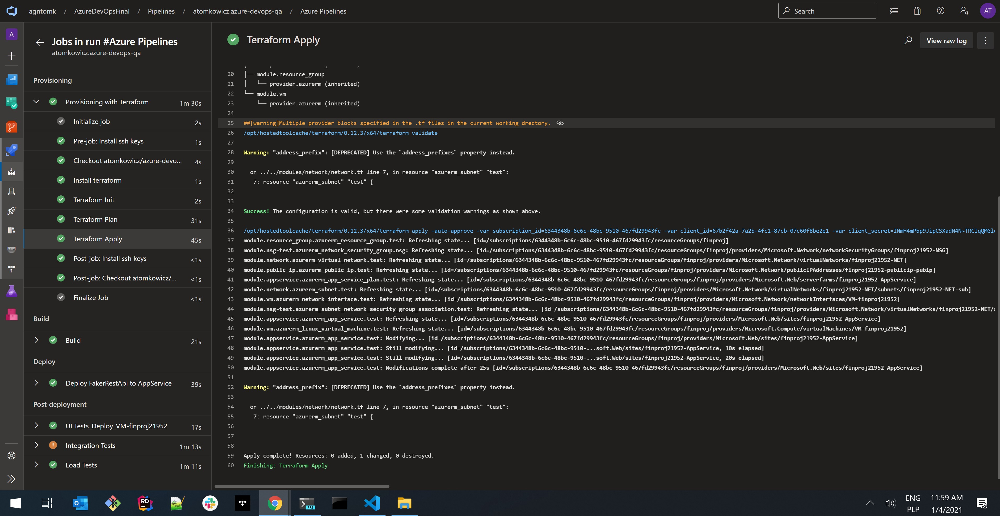

### Deployed fakerestapi
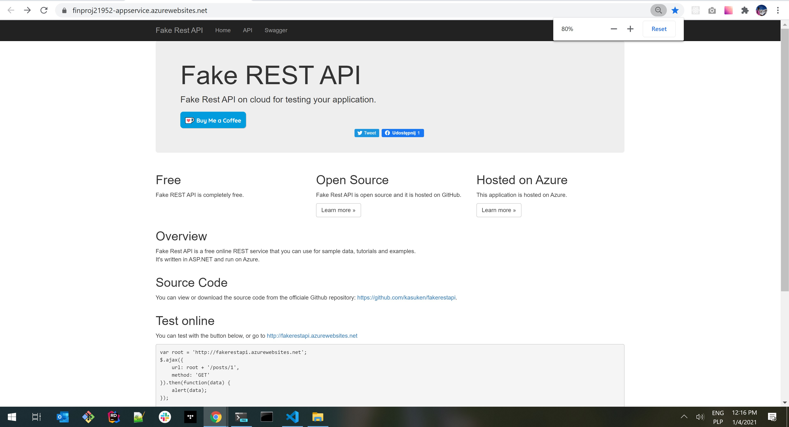

### Successful execution of the pipeline build results page
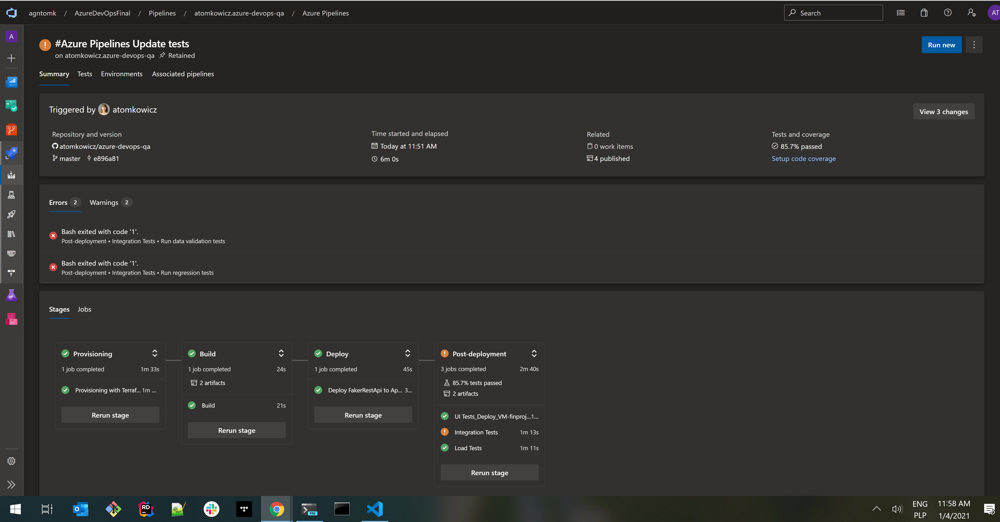

### Log output of JMeter when executed by the CI/CD pipeline
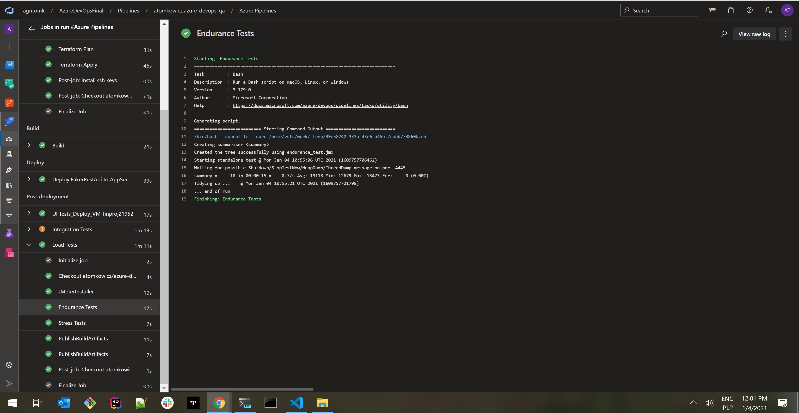

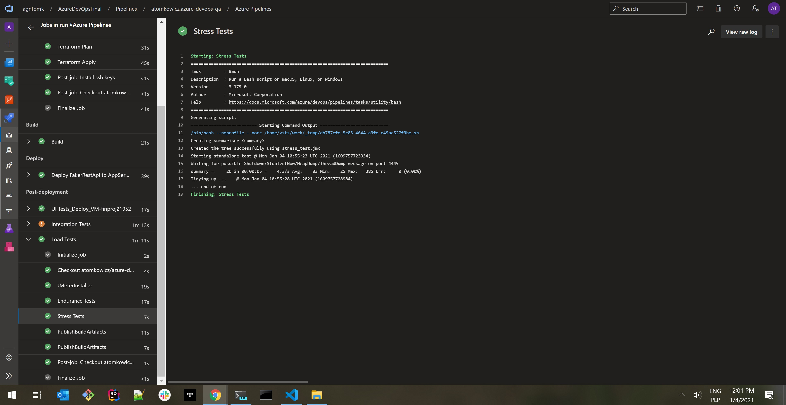

### Execution of the UI (Selenium) test suite by the CI/CD pipeline
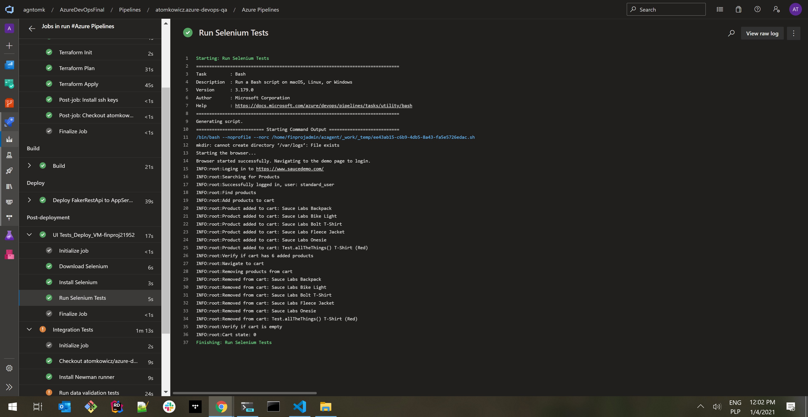

### Execution of the Integration test suite by the CI/CD pipeline
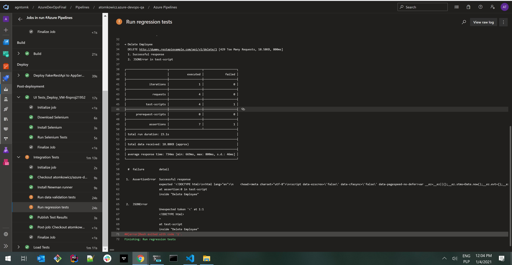
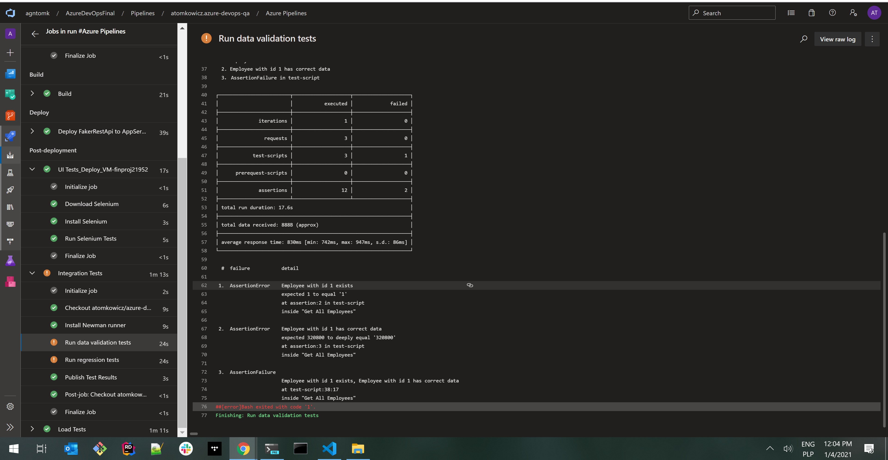
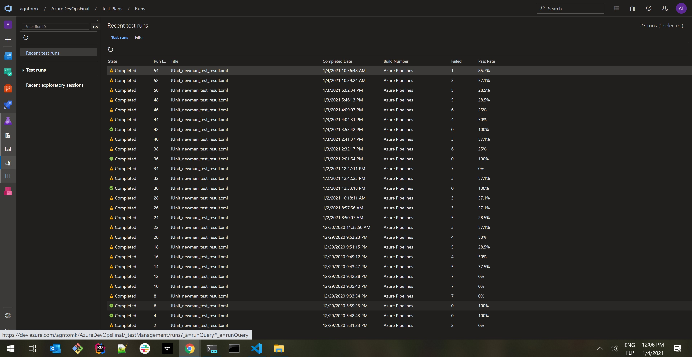


### Email received when the 404 alert is triggered
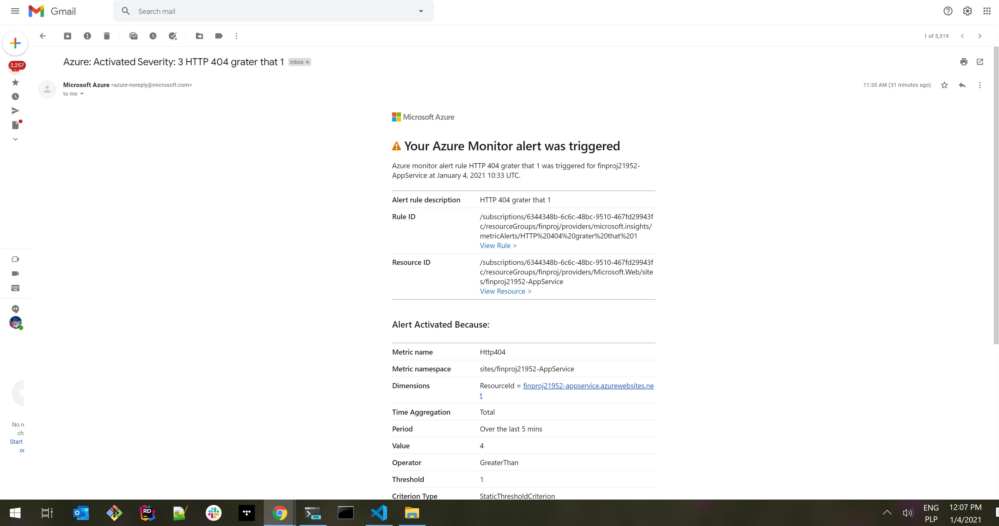

### Appservice metrics
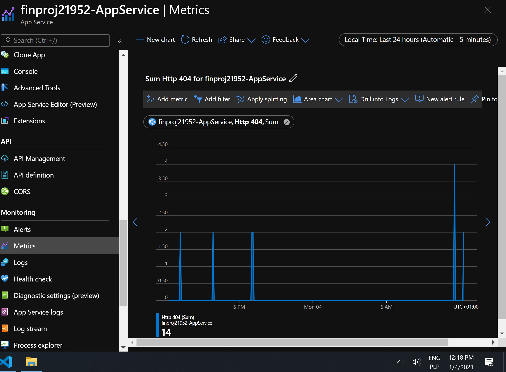
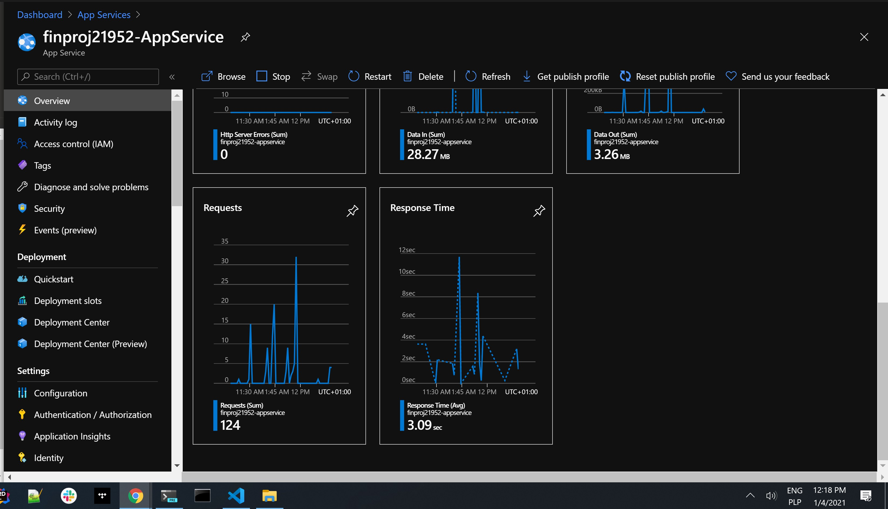
### Log analytics queries
